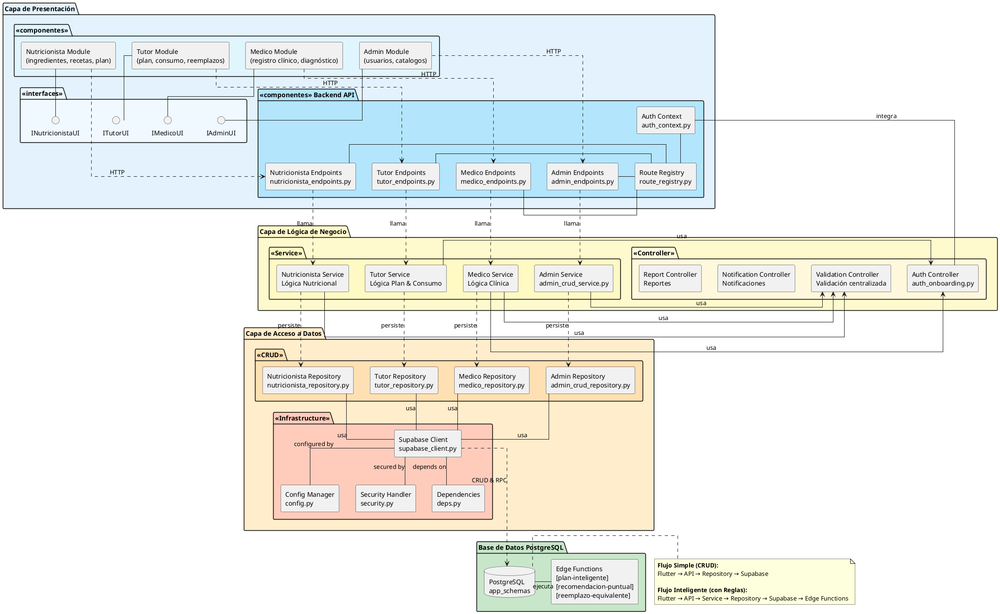

# Diagrama de Componentes - Arquitectura Reuma Nutri



## Estructura de Componentes por Capa

### 1️⃣ Capa Presentación
- **Frontend Flutter**: Módulos separados por rol (Admin, Medico, Nutricionista, Tutor)
- **Backend API FastAPI**: Endpoints organizados por rol + Auth Context + Health Check
- **Route Registry**: Orquestación declarativa y OOP de todas las rutas

### 2️⃣ Capa Aplicación/Negocio
- **Servicios por Rol**: Lógica específica de cada rol
- **Servicios Compartidos**: Auth, Validación, Notificaciones
- Las reglas de negocio se concentran en esta capa, NO en endpoints ni widgets

### 3️⃣ Capa Infraestructura
- **Repositorios**: Adaptadores de persistencia por rol
- **Core**: Configuración, seguridad, cliente Supabase, autenticación

### 4️⃣ Persistencia
- **PostgreSQL + Supabase**: Base de datos principal
- **Edge Functions**: Lógica serverless (plan inteligente, recomendaciones, reemplazos)
- **Datos CSV**: Ingredientes y datos OMS cargados bulk

## Flujos de Integración

```
✅ Flujo Simple (CRUD):
   Flutter → FastAPI Endpoint → Repositorio → Supabase

✅ Flujo Inteligente (con reglas):
   Flutter → FastAPI Endpoint → Servicio → Repositorio → Supabase → Edge Functions
```

## Convenciones Operativas
1. Nuevos endpoints → `backend/app/api/v1/endpoints/roles/<rol>_endpoints.py`
2. Nueva lógica → `backend/app/services/roles/<rol>/`
3. Nuevos módulos frontend → `frontend/flutter_app/lib/features/roles/`
