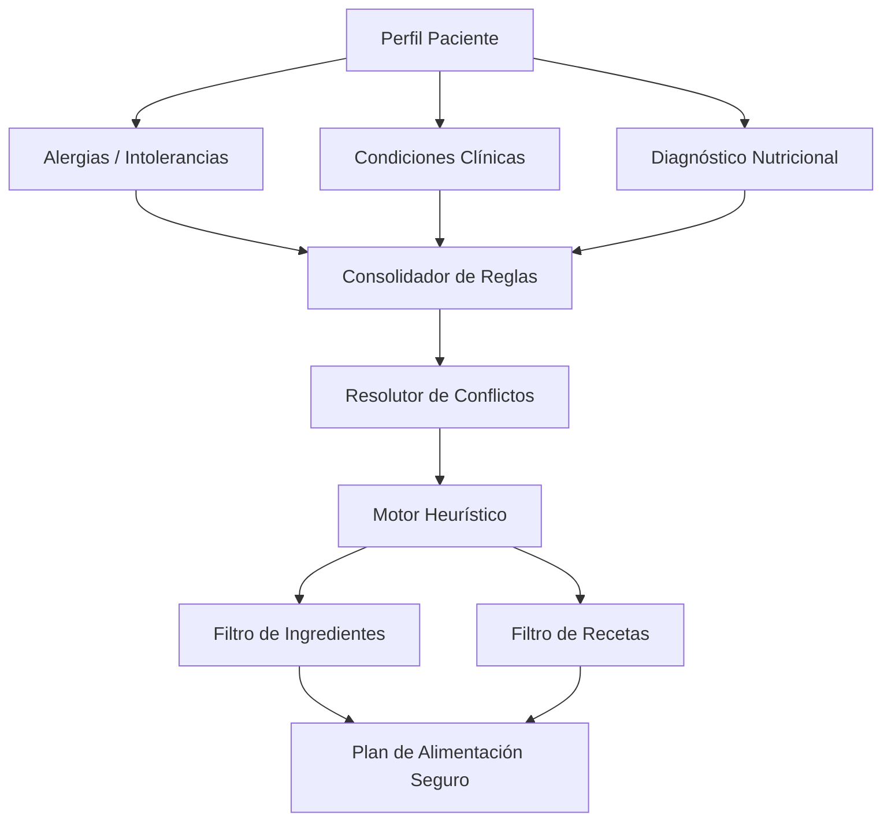

# Reglas Clínicas y Nutricionales del Motor de Recomendaciones

Este documento presenta un informe detallado sobre las reglas del motor de recomendaciones del proyecto **NutriReumav2**. Describe tanto las reglas clínicas como las nutricionales y explica el funcionamiento técnico del motor de inferencia en el backend.

---

## 1. Arquitectura del Motor de Recomendaciones

El motor está estructurado en tres componentes clave del dominio:

1. **Inferencia y Expansión de Reglas**: Implementado en [ServicioMotorHeuristico](file:///C:/Users/romme/OneDrive/Documentos/repos/programatesis/backend/app/domain/servicios/servicio_heuristico.py), toma reglas definidas a nivel abstracto (grupos alimentarios, subgrupos o etiquetas nutricionales) y las expande a nivel de ingredientes y recetas prohibidas/permitidas.
2. **Resolución de Conflictos**: Implementado en [ServicioResolutorConflictos](file:///C:/Users/romme/OneDrive/Documentos/repos/programatesis/backend/app/domain/servicios/resolutor_conflictos.py), prioriza las reglas según la jerarquía clínica y médica sobre las nutricionales, resolviendo choques de acciones (`ELIMINAR` > `DISMINUIR` > `PRIORIZAR`).
3. **Casos de Uso**: Coordinado por [CasoUsoEvaluarReglasPaciente](file:///C:/Users/romme/OneDrive/Documentos/repos/programatesis/backend/app/aplicacion/nutricion/evaluar_reglas_paciente.py) que reúne alergias, patologías y estados nutricionales para calcular el perfil apto del paciente.

---

## 2. Reglas Clínicas (`CLINICA`)

Las reglas clínicas se asocian a condiciones reumáticas o de patología base del paciente y tienen prioridad máxima para garantizar la seguridad alimentaria.

### 2.1. Lupus Eritematoso Sistémico (LES)
Orientadas a evitar brotes, proteger la función renal y cardiovascular, y promover un patrón antioxidante.

| Acción | Objetivo | Elemento / Etiqueta | Justificación / Mensaje de Error | Estricta |
| :--- | :--- | :--- | :--- | :---: |
| **`Eliminar`** | Etiqueta | Contiene alfalfa o L-canavanina | No apta LES: contiene alfalfa / L-canavanina | Sí |
| **`Disminuir`** | Etiqueta | Muy alta fuente de proteína | LES condicional: disminuir exceso proteico si daño renal | No |
| **`Disminuir`** | Etiqueta | Alto en potasio | LES condicional: disminuir si nefritis/restricción renal | No |
| **`Disminuir`** | Etiqueta | Alto en fósforo | LES condicional: disminuir si nefritis/restricción renal | No |
| **`Disminuir`** | Etiqueta | Riesgo / Riesgo moderado de retención de líquidos | LES: disminuir por retención de líquidos | No |
| **`Priorizar`** | Etiqueta | Rico en omega 3 / Balance favorable de omegas | LES: priorizar antioxidantes y omega 3 | No |
| **`Priorizar`** | Etiqueta | Alto poder antioxidante | LES: priorizar antioxidantes y omega 3 | No |
| **`Priorizar`** | Etiqueta | Bajo índice glucémico / Energía estable | LES: priorizar protección cardiorrenal/metabólica | No |
| **`Priorizar`** | Etiqueta | Equilibrio de líquidos ideal | LES: priorizar protección cardiorrenal/metabólica | No |
| **`Priorizar`** | Etiqueta | Alta/Media fuente de vitamina D y Calcio | LES: priorizar salud ósea | No |

### 2.2. Artritis Idiopática Juvenil (AIJ)
Enfoque en mejorar la adherencia pediátrica, facilitar el consumo físico ante dificultad temporomandibular y asegurar aporte de micro y macronutrientes.

| Acción | Objetivo | Elemento / Etiqueta | Justificación / Mensaje de Error | Estricta |
| :--- | :--- | :--- | :--- | :---: |
| **`Priorizar`** | Etiqueta | Alimento terapéutico nutricional / Densidad energética alta nutritiva | AIJ condicional: priorizar densidad energética nutritiva | No |
| **`Priorizar`** | Etiqueta | Buena tolerancia digestiva / Fácil de consumir / Textura blanda o suave | AIJ: priorizar fácil consumo y adherencia (brotes articulares) | No |
| **`Priorizar`** | Etiqueta | Rico en omega 3 / Balance favorable | AIJ: priorizar omega 3 pediátrico | No |
| **`Priorizar`** | Etiqueta | Alta/Media fuente de vitamina D y Calcio | AIJ: priorizar salud ósea | No |
| **`Priorizar`** | Etiqueta | Proteína magra / Alta/Media fuente de proteína | AIJ: priorizar crecimiento y masa muscular | No |
| **`Disminuir`** | Etiqueta | Completo / Salado | AIJ condicional: disminuir si dificultad de consumo en brote | No |
| **`Disminuir`** | Etiqueta | Baja densidad calórica | AIJ condicional: disminuir baja densidad si riesgo nutricional | No |

### 2.3. General Reumáticos
Reglas aplicadas transversalmente a todas las patologías reumáticas para modular la inflamación y proteger el sistema cardiovascular.

*   **Ingredientes Eliminados (Estrictos):**
    *   Manteca de cerdo (No apta)
    *   Margarina (No apta)
    *   Aceite de palma (No apta)
*   **Ingredientes Disminuidos (Estrictos):**
    *   Mantequilla (No apta / disminuir)
*   **Subgrupos Eliminados / Disminuidos (Estrictos):**
    *   Embutidos curados (sin gluten) / Embutidos frescos y cocidos
    *   Salazones de pescado / Pescados ahumados
    *   Bebidas isotónicas / Zumos y néctares comerciales
*   **Priorizaciones Clave:**
    *   *Aceite de oliva virgen extra* (ingrediente individual) y *Pescado azul* (subgrupo).
    *   *Frutas frescas* y *Verduras frescas* (subgrupos).
    *   Etiquetas nutricionales: *Altamente antiinflamatorio*, *Antiinflamatorio*, *Rico en omega 3*, *Grasa saludable*, *Alta fuente de fibra*, *Natural o mínimamente procesado*.
*   **Disminuciones Recomendadas:**
    *   Etiquetas: *Calorías vacías*, *Bebida azucarada*, *Alto en azúcar añadido*, *Muy alto en sodio*, *Proinflamatorio*, *Altamente inflamatorio*, *Ultraprocesado*, *Contiene grasas trans*, *Alto índice glucémico*.

---

## 3. Reglas Nutricionales (`NUTRICIONAL`)

Derivadas de la evaluación antropométrica y el diagnóstico nutricional. Se orientan a corregir déficits calóricos/proteicos o a controlar el exceso ponderal.

### 3.1. Sobrepeso / Obesidad / Peso Elevado
El objetivo es reducir la densidad calórica y controlar factores de riesgo cardiovascular.

*   **Disminuir:**
    *   Grupos alimentarios: *Azúcares, Dulces Y Pastelería* (alta prioridad por baja saciedad y alta densidad), *Aceites Y Grasas* (controlar porciones, no eliminar saludables), *Cereales* (limitar refinados, preferir integrales) y *Bebidas* (azucaradas).
    *   Etiquetas nutricionales: *Alto en grasa saturada*, *Alto en grasas*, *Alto índice glucémico*.
*   **Priorizar:**
    *   Grupos alimentarios: *Verduras Y Hortalizas* (saciedad y micronutrientes).
    *   Etiquetas nutricionales: *Baja densidad calórica*, *Proteína magra*, *Bajo índice glucémico*, *Alta fuente de fibra*.

### 3.2. Bajo Peso / Bajo Peso Severo / Delgadez / Emaciación
Orientado a aumentar la densidad energética y asegurar una adecuada recuperación ponderal.

*   **Priorizar:**
    *   Grupos alimentarios: *Carnes Y Derivados*, *Legumbres*, *Lácteos Y Derivados* (alta prioridad para crecimiento), *Huevos Y Derivados* (proteína completa) y *Aceites Y Grasas* (aumentar calorías sin volumen excesivo).
    *   Subgrupos: *Pescado azul* y *Frutas frescas*.
    *   Etiquetas nutricionales: *Alta fuente de proteína*, *Muy alta fuente de proteína*, *Moderado en grasas*, *Natural o mínimamente procesado*.
*   **Disminuir:**
    *   Grupos/Subgrupos: *Verduras Y Hortalizas* (evitar que el volumen desplace a alimentos calóricos), *Bebidas* (jugos/azucarados que desplazan comidas principales), *Dulces con lácteos*.
    *   Etiquetas nutricionales: *Baja densidad calórica* (llena el estómago sin energía suficiente) y *Alto en sodio* (riesgo hidroelectrolítico en desnutrición severa).

### 3.3. Talla Baja / Talla Baja Severa
Enfoque en salud ósea y aporte de micronutrientes/proteínas claves para el crecimiento lineal.

*   **Priorizar:**
    *   Grupos/Subgrupos: *Lácteos Y Derivados*, *Yogures animales sin lactosa* (en caso de intolerancias secundarias), *Pescado azul*, *Carnes Y Derivados*, *Legumbres*.
    *   Etiquetas nutricionales: *Alta fuente de proteína*, *Alta fuente de vitamina D*, *Media fuente de vitamina D*, *Alta fuente de calcio*.

---

> [!NOTE]
> Las reglas temporales (`TEMPORAL`), como las de diarrea, heridas bucales, reflujo o náuseas, se aplican sobre ingredientes muy específicos (p. ej., evitar picantes, ácidos y texturas duras en heridas bucales) y tienen una validez acotada en el tiempo para resolver sintomatología aguda.
